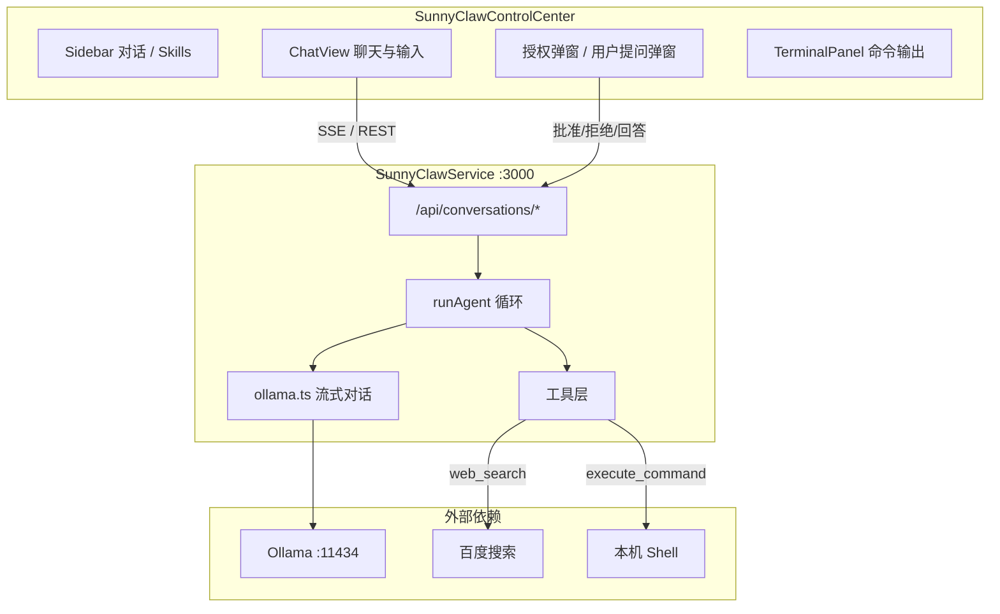

# SunnyClaw

SunnyClaw 是一个面向本机的 **AI Agent 系统**，对标 [OpenClaw](https://github.com/openclaw/openclaw) 的思路：通过大模型理解用户意图，自动调用工具（执行命令、联网搜索、向用户提问等），在浏览器中完成对话式操作与可视化反馈。

默认使用本地 **[Ollama](https://ollama.com/)** 运行开源模型，数据与命令均在 `127.0.0.1` 上处理，适合个人开发与自动化场景。

---

## 功能概览

| 能力 | 说明 |
|------|------|
| **对话式 Agent** | 多轮对话，流式输出回复，展示思考用时 |
| **执行本机命令** | 调用 `execute_command` 在 Windows / macOS / Linux 上运行 Shell，结果在终端面板与消息中展示 |
| **联网搜索** | 可选开启百度搜索，将摘要注入模型后生成回答 |
| **高危命令确认** | 删除、格式化、关机类命令需在前端弹窗授权后执行 |
| **向用户提问** | 模型可通过 `ask_user` 发起澄清问题，支持快捷选项 |
| **自定义 Skills** | 在侧边栏注册额外「技能」工具定义，扩展 Agent 能力 |
| **文件附件** | 支持上传文件，内容作为上下文发给模型 |
| **Markdown 渲染** | 助手回复支持 GFM Markdown |
| **小模型适配** | 针对 7B 级量化模型：自动匹配已安装 Ollama 模型名、文本级工具推断、过滤工具调用垃圾输出 |

---

## 系统架构



### 请求链路（发送一条消息）

1. 前端 `POST /api/conversations/:id/messages`，建立 **SSE** 连接。
2. 后端将用户消息写入内存会话，调用 `runAgent()`。
3. Agent 按轮次调用 Ollama；根据用户意图决定是否挂载工具；解析模型输出或**推断**工具调用。
4. 执行工具后将结果以 `tool` 消息塞回上下文，继续生成，直至产出最终自然语言或达到轮次上限。
5. 全程通过 SSE 推送：`content`、`tool_call`、`tool_result`、`permission_request`、`terminal_*`、`done` 等事件。

### 目录结构

```
SunnyClaw/
├── SunnyClawControlCenter/     # 前端（React 19 + Vite 8 + TypeScript）
│   └── src/
│       ├── components/         # ChatView、Sidebar、MessageBubble、弹窗、终端
│       ├── services/api.ts     # REST / SSE 客户端
│       └── utils/              # 展示层内容清洗
├── SunnyClawService/           # 后端（Express 5 + TypeScript）
│   └── src/
│       ├── routes/chat.ts      # HTTP / SSE 路由
│       ├── services/
│       │   ├── agent.ts        # Agent 主循环
│       │   └── ollama.ts       # Ollama 流式 API
│       ├── tools/              # execute_command、web_search、技能执行
│       └── utils/              # 工具解析、风险判定、平台上下文等
├── .husky/                     # Git hooks
├── commitlint.config.js
├── package.json                # 根目录（husky / commitlint）
└── README.md
```

---

## 技术栈

| 层级 | 技术 |
|------|------|
| 前端 | React 19、TypeScript、Vite 8、react-markdown |
| 后端 | Node.js、Express 5、TypeScript |
| 模型 | Ollama Chat API（流式） |
| 搜索 | 百度网页抓取 + cheerio 解析 |
| 规范 | Husky、Commitlint（Conventional Commits） |

---

## 快速开始

### 前置条件

- **Node.js** 18+（推荐 20+）
- **Ollama** 已安装并运行，且已拉取至少一个对话模型（如 `qwen2.5:7b-instruct` 或带量化后缀的变体）

### 安装

```bash
# 根目录（Git hooks）
npm install

# 后端
cd SunnyClawService
npm install

# 前端
cd ../SunnyClawControlCenter
npm install
```

### 启动

**终端 1 — 后端**（仅监听本机）：

```bash
cd SunnyClawService
npm run dev
# → http://127.0.0.1:3000
```

**终端 2 — 前端**：

```bash
cd SunnyClawControlCenter
npm run dev
# → 默认 http://localhost:5173，/api 代理到后端
```

浏览器打开 Vite 提示的地址即可使用。

### 生产构建

```bash
cd SunnyClawService && npm run build && npm start
cd SunnyClawControlCenter && npm run build
# 静态资源在 SunnyClawControlCenter/dist，需自行用静态服务器托管并配置 API 代理
```

---

## 配置说明

通过**环境变量**配置后端（在启动 `SunnyClawService` 前设置）：

| 变量 | 默认值 | 说明 |
|------|--------|------|
| `OLLAMA_BASE` | `http://127.0.0.1:11434` | Ollama 服务地址 |
| `OLLAMA_MODEL` | `qwen2.5:7b-instruct` | 首选模型名；若未安装会自动匹配相近名称 |
| `OLLAMA_TIMEOUT_MS` | `120000` | 单次请求总超时（毫秒） |
| `OLLAMA_IDLE_TIMEOUT_MS` | `90000` | 流式无数据空闲超时 |
| `OLLAMA_NATIVE_TOOLS` | 未设置（关闭） | 设为 `true` 时向 Ollama 传递原生 `tools` 字段（小模型建议保持关闭） |

健康检查：`GET http://127.0.0.1:3000/api/health` 可查看当前解析到的模型名。

---

## 主要 API

| 方法 | 路径 | 说明 |
|------|------|------|
| `GET` | `/api/health` | 服务与 Ollama 模型状态 |
| `GET` | `/api/conversations` | 对话列表 |
| `POST` | `/api/conversations` | 新建对话 |
| `GET` | `/api/conversations/:id` | 对话详情（含消息） |
| `DELETE` | `/api/conversations/:id` | 删除对话 |
| `POST` | `/api/conversations/:id/messages` | 发送消息，**SSE** 流式响应 |
| `POST` | `/api/permissions/:requestId` | 确认/拒绝高危命令 |
| `POST` | `/api/questions/:requestId` | 回答 Agent 发起的提问 |

> 会话数据保存在**进程内存**中，重启后端后丢失。

---

## 内置工具

| 工具名 | 作用 |
|--------|------|
| `execute_command` | 在本机执行 Shell 命令（语法随 OS 自动提示） |
| `web_search` | 百度搜索并返回摘要（需在前端开启联网搜索） |
| `ask_user` | 向前端弹出提问框，等待用户选择或输入 |

侧边栏注册的 **Skills** 会作为额外 function 定义传给 Agent（具体执行逻辑可在 `tools/index.ts` 中扩展）。

---

## 开发说明

- 后端热重载：`SunnyClawService` 下 `npm run dev`（tsx watch）
- 前端热重载：`SunnyClawControlCenter` 下 `npm run dev`
- 类型检查 / 构建：各子项目内 `npm run build`

### Commit 规范

使用 [Conventional Commits](https://www.conventionalcommits.org/)，由 commitlint + husky 校验：

```
<type>(<scope>): <subject>
```

常用 `type`：`feat`、`fix`、`docs`、`style`、`refactor`、`test`、`chore`

---

## 安全提示

- 服务默认绑定 **`127.0.0.1`**，请勿在未加固的情况下暴露到公网。
- Agent 可在本机执行命令；高危操作需用户在前端明确授权。
- 联网搜索会访问外部网站，请注意网络与隐私策略。

---

## License

ISC
